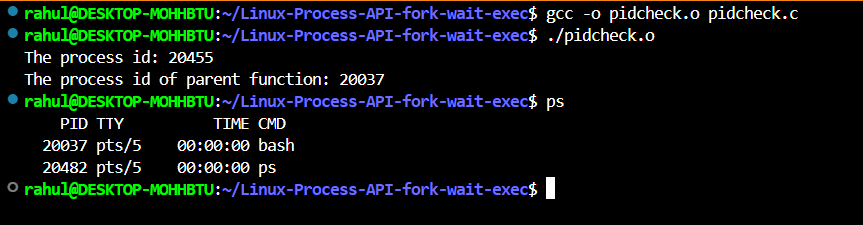
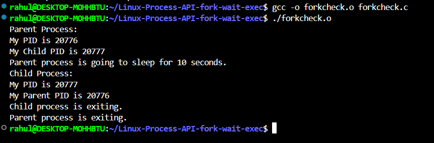
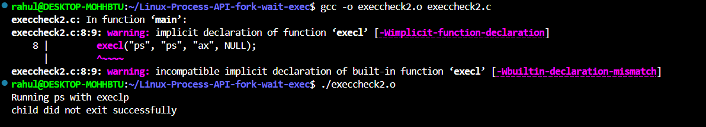

# Linux-Process-API-fork-wait-exec-
Ex02-Linux Process API-fork(), wait(), exec()
# Ex02-OS-Linux-Process API - fork(), wait(), exec()
Operating systems Lab exercise


# AIM:
To write C Program that uses Linux Process API - fork(), wait(), exec()

# DESIGN STEPS:

### Step 1:

Navigate to any Linux environment installed on the system or installed inside a virtual environment like virtual box/vmware or online linux JSLinux (https://bellard.org/jslinux/vm.html?url=alpine-x86.cfg&mem=192) or docker.

### Step 2:

Write the C Program using Linux Process API - fork(), wait(), exec()

### Step 3:

Test the C Program for the desired output. 

# PROGRAM:

## C Program to print process ID and parent Process ID using Linux API system calls

```
#include <stdio.h>
#include <sys/types.h>
#include <unistd.h>
int main(void)
{	//variable to store calling function's process id
	pid_t process_id;
	//variable to store parent function's process id
	pid_t p_process_id;
	//getpid() - will return process id of calling function
	process_id = getpid();
	//getppid() - will return process id of parent function
	p_process_id = getppid();
	//printing the process ids

//printing the process ids
	printf("The process id: %d\n",process_id);
	printf("The process id of parent function: %d\n",p_process_id);
	return 0; }

```
## OUTPUT



## C Program to create new process using Linux API system calls fork() and exit()


```
#include <stdio.h>
#include <stdlib.h>
#include <unistd.h>

int main() {
    pid_t pid;

    
    pid = fork();

    if (pid < 0) {
        
        perror("fork");
        exit(1);
    } else if (pid == 0) {
      
        printf("Child Process:\n");
        printf("My PID is %d\n", getpid());
        printf("My Parent PID is %d\n", getppid());
        printf("Child process is exiting.\n");
        exit(0);  
    } else {
       
        printf("Parent Process:\n");
        printf("My PID is %d\n", getpid());
        printf("My Child PID is %d\n", pid);
        printf("Parent process is going to sleep for 10 seconds.\n");
        sleep(10); 
        printf("Parent process is exiting.\n");
        exit(0);  
    }
}

```
## OUTPUT



## C Program to execute Linux system commands using Linux API system calls exec() family

```
#include <stdlib.h>
#include <stdio.h>
#include <sys/wait.h>
#include <sys/types.h>
int main()
{       int status;
        printf("Running ps with execlp\n");
        execl("ps", "ps", "ax", NULL);
        wait(&status);
        if (WIFEXITED(status))
                printf("child exited with status of %d\n", WEXITSTATUS(status));
        else
                puts("child did not exit successfully\n");
        printf("Done.\n");
printf("Running ps with execlp. Now with path specified\n");
        execl("/bin/ps", "ps", "ax", NULL);
        wait(&status);
        if (WIFEXITED(status))
                printf("child exited with status of %d\n", WEXITSTATUS(status));
        else
                puts("child did not exit successfully\n");
        printf("Done.\n");
        exit(0);}

 
```

## OUTPUT



# RESULT:
The programs are executed successfully.
